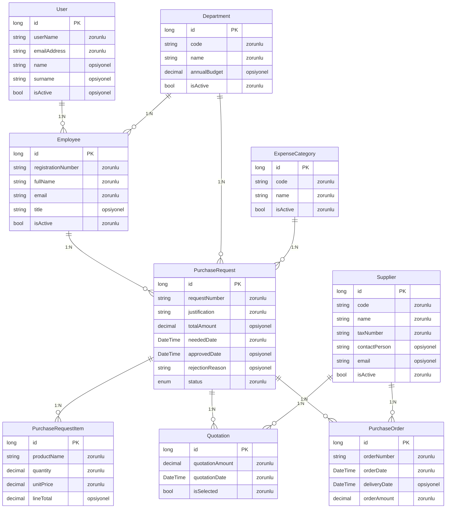
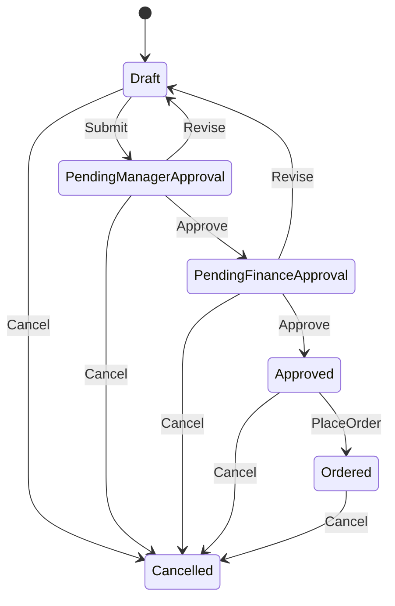
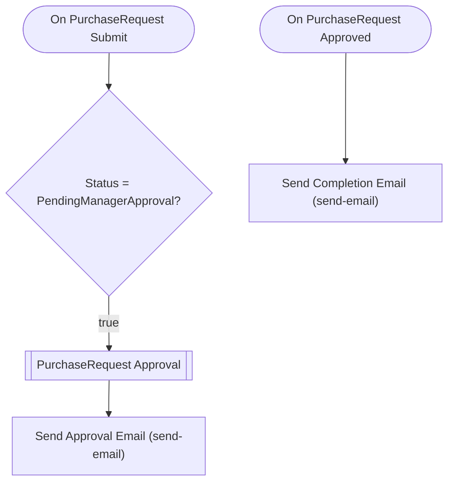

# departmentapp2 — Talep Analizi

> Bu belge Archipid talep olgunlaştırma (discovery) akışıyla üretildi.

## Orijinal Talep

Kurumsal bir "Satın Alma Talep ve Onay Yönetim Sistemi" istiyorum.

## Master data / parametre entity'leri:

- Department (Birim): birim kodu, birim adı, yıllık bütçe, aktif/pasif
- Employee (Personel): sicil numarası, ad soyad, e-posta, birim (Department
  ilişkili), unvan, aktif/pasif
- Supplier (Tedarikçi): tedarikçi kodu, tedarikçi adı, vergi numarası,
  iletişim kişisi, e-posta, aktif/pasif
- ExpenseCategory (Harcama Kalemi): kalem kodu, kalem adı (örn. BT Donanım,
  Danışmanlık, Sarf Malzeme), aktif/pasif

## Operasyonel entity'ler:

- PurchaseRequest (Satın Alma Talebi): talep numarası, talep eden (Employee
  ilişkili), talep eden birim (Department ilişkili), harcama kalemi
  (ExpenseCategory ilişkili), gerekçe, toplam tutar, ihtiyaç tarihi,
  red gerekçesi, durum
- PurchaseRequestItem (Talep Kalemi): talep (PurchaseRequest ilişkili),
  ürün/hizmet adı, miktar, birim fiyat, satır tutarı — bir talepte birden
  fazla kalem olabilir
- Quotation (Teklif): talep (PurchaseRequest ilişkili), tedarikçi (Supplier
  ilişkili), teklif tutarı, teklif tarihi, seçildi mi
- PurchaseOrder (Sipariş): talep (PurchaseRequest ilişkili), sipariş numarası,
  tedarikçi (Supplier ilişkili), sipariş tarihi, teslim tarihi, sipariş tutarı

Toplam 8 entity olsun, fazlasını ekleme.

## RBAC rolleri:

Requester (Talep Eden), DepartmentManager (Birim Müdürü), FinanceApprover
(Finans Onaycısı), PurchasingOfficer (Satın Alma Sorumlusu) sistem rolleri olsun.

## Onay akışı (state machine) — PurchaseRequest için:

Draft → PendingManagerApproval → PendingFinanceApproval → Approved → Ordered

Onay adımları ROL bazlı olsun:

- PendingManagerApproval adımı DepartmentManager rolüne atansın.
- PendingFinanceApproval adımı FinanceApprover rolüne atansın.
- Approved → Ordered geçişini PurchasingOfficer rolü yapsın.
- Herhangi bir onaycı reddederse talep Draft'a geri dönsün (revizyon) ve
  red gerekçesi zorunlu olsun.

Kural: Draft'tan onaya göndermek için talebin en az bir PurchaseRequestItem
kaydı bulunsun.
Kural: Approved'dan Ordered'a geçmek için talebin seçilmiş en az bir Quotation
kaydı bulunsun.

## Dashboard:

- Onayımı bekleyen talep sayısı
- Durum bazında talep dağılımı
- Birim bazında talep tutarı dağılımı
- Ortalama onay süresi (gün) — talep tarihinden onay tarihine
- İhtiyaç tarihi geçmiş, hâlâ onaylanmamış talepler listesi

## Özet

Bu uygulama, kurumun tüm satın alma taleplerini dijital ortamda yönetir. Çalışanlar ihtiyaç duydukları ürün veya hizmetleri sisteme girerek onay sürecine sunar; birim müdürü ve finans birimi sırasıyla onaylar; satın alma sorumlusu teklifleri değerlendirerek siparişi oluşturur.

Talep eden çalışan, talebi kalemlerle birlikte taslak olarak oluşturur ve onaya gönderir. Önce birim müdürü inceler; uygun bulursa finans onaycısına iletilir. Finans onayından geçen talep 'Onaylandı' durumuna geçer. Satın alma sorumlusu teklifleri sisteme girer, uygun tedarikçiyi seçer ve siparişi oluşturarak talebi 'Siparişe Alındı' durumuna taşır. Herhangi bir onaycı reddederse talep red gerekçesiyle taslak aşamasına geri döner ve talep eden düzeltip yeniden gönderebilir.

## Kapsam

- (belirtilmedi)

## Kapsam Dışı

- (belirtilmedi)

## Açık Noktalar

- (belirtilmedi)

## Eksiklikler

- (belirtilmedi)

## Öneriler

- (belirtilmedi)

## Veri Modeli

### User — Kullanıcı (Sistem)

| Alan | Tip | Zorunlu | Uzunluk |
|---|---|---|---|
| `id` | long | Evet | — |
| `userName` | string | Evet | 64 |
| `emailAddress` | string | Evet | 256 |
| `name` | string | Hayır | 128 |
| `surname` | string | Hayır | 128 |
| `isActive` | bool | Hayır | — |

**Neye bağlı:** Employee (1:N, bu tablo "bir" tarafı)

### Department — Birim

| Alan | Tip | Zorunlu | Uzunluk |
|---|---|---|---|
| `id` | long | Evet | — |
| `code` | string | Evet | 20 |
| `name` | string | Evet | 200 |
| `annualBudget` | decimal | Hayır | — |
| `isActive` | bool | Evet | — |

**Neye bağlı:** Employee (1:N, bu tablo "bir" tarafı) · PurchaseRequest (1:N, bu tablo "bir" tarafı)

### Employee — Personel

| Alan | Tip | Zorunlu | Uzunluk |
|---|---|---|---|
| `id` | long | Evet | — |
| `registrationNumber` | string | Evet | 50 |
| `fullName` | string | Evet | 200 |
| `email` | string | Evet | 256 |
| `title` | string | Hayır | 100 |
| `isActive` | bool | Evet | — |

**Neye bağlı:** User (1:N, bu tablo "çok" tarafı) · Department (1:N, bu tablo "çok" tarafı) · PurchaseRequest (1:N, bu tablo "bir" tarafı)

### Supplier — Tedarikçi

| Alan | Tip | Zorunlu | Uzunluk |
|---|---|---|---|
| `id` | long | Evet | — |
| `code` | string | Evet | 20 |
| `name` | string | Evet | 200 |
| `taxNumber` | string | Evet | 20 |
| `contactPerson` | string | Hayır | 200 |
| `email` | string | Hayır | 256 |
| `isActive` | bool | Evet | — |

**Neye bağlı:** Quotation (1:N, bu tablo "bir" tarafı) · PurchaseOrder (1:N, bu tablo "bir" tarafı)

### ExpenseCategory — Harcama Kalemi

| Alan | Tip | Zorunlu | Uzunluk |
|---|---|---|---|
| `id` | long | Evet | — |
| `code` | string | Evet | 20 |
| `name` | string | Evet | 200 |
| `isActive` | bool | Evet | — |

**Neye bağlı:** PurchaseRequest (1:N, bu tablo "bir" tarafı)

### PurchaseRequest — Satın Alma Talebi

| Alan | Tip | Zorunlu | Uzunluk |
|---|---|---|---|
| `id` | long | Evet | — |
| `requestNumber` | string | Evet | 50 |
| `justification` | string | Evet | 1000 |
| `totalAmount` | decimal | Hayır | — |
| `neededDate` | DateTime | Evet | — |
| `approvedDate` | DateTime | Hayır | — |
| `rejectionReason` | string | Hayır | 1000 |
| `status` | enum (Draft,PendingManagerApproval,PendingFinanceApproval,Approved,Ordered,Cancelled) | Evet | — |

**Neye bağlı:** Employee (1:N, bu tablo "çok" tarafı) · Department (1:N, bu tablo "çok" tarafı) · ExpenseCategory (1:N, bu tablo "çok" tarafı) · PurchaseRequestItem (1:N, bu tablo "bir" tarafı) · Quotation (1:N, bu tablo "bir" tarafı) · PurchaseOrder (1:N, bu tablo "bir" tarafı)

### PurchaseRequestItem — Talep Kalemi

| Alan | Tip | Zorunlu | Uzunluk |
|---|---|---|---|
| `id` | long | Evet | — |
| `productName` | string | Evet | 300 |
| `quantity` | decimal | Evet | — |
| `unitPrice` | decimal | Evet | — |
| `lineTotal` | decimal | Hayır | — |

**Neye bağlı:** PurchaseRequest (1:N, bu tablo "çok" tarafı)

### Quotation — Teklif

| Alan | Tip | Zorunlu | Uzunluk |
|---|---|---|---|
| `id` | long | Evet | — |
| `quotationAmount` | decimal | Evet | — |
| `quotationDate` | DateTime | Evet | — |
| `isSelected` | bool | Evet | — |

**Neye bağlı:** PurchaseRequest (1:N, bu tablo "çok" tarafı) · Supplier (1:N, bu tablo "çok" tarafı)

### PurchaseOrder — Sipariş

| Alan | Tip | Zorunlu | Uzunluk |
|---|---|---|---|
| `id` | long | Evet | — |
| `orderNumber` | string | Evet | 50 |
| `orderDate` | DateTime | Evet | — |
| `deliveryDate` | DateTime | Hayır | — |
| `orderAmount` | decimal | Evet | — |

**Neye bağlı:** PurchaseRequest (1:N, bu tablo "çok" tarafı) · Supplier (1:N, bu tablo "çok" tarafı)

## İş Akışları

### Satın Alma Talebi — durum makinesi

**Onay adımları**

| # | Adım | Atanan | Aksiyonlar | Zorunlu alanlar |
|---|---|---|---|---|
| 1 | Birim Müdürü Onayı | Rol: `DepartmentManager` | Onayla (approve), Reddet (revise) | `rejectionReason` |
| 2 | Finans Onayı | Rol: `FinanceApprover` | Onayla (approve), Reddet (revise) | `rejectionReason` |

Reddedilirse kayıt **`Draft`** durumuna döner.

### Akış: PurchaseRequest Approval Flow

Auto-generated approval flow for PurchaseRequest. Customize email templates and add conditions as needed.

## Elle Geliştirme Gerektirenler

Aşağıdaki maddeler senaryonun gereği ama üretilen koda yansımıyor — kod yazılması gerekir.

| Alan | İş | Neden | Geçici çözüm |
|---|---|---|---|
| entity | Satır tutarı (lineTotal) otomatik hesaplanmıyor | Hesaplanan alan üretimi desteklenmiyor; lineTotal = quantity × unitPrice formülü koda yansımaz. | Alan normal decimal alan olarak durur; kullanıcı değeri kendisi girer veya geliştirici tetikleyici (trigger) ile hesaplar. |
| flow | Toplam tutar (totalAmount) kalemlerden otomatik güncellenmiyor | PurchaseRequestItem kalemleri eklendikçe PurchaseRequest.totalAmount otomatik güncellenemez; çapraz kayıt otomasyonu desteklenmiyor. | Kullanıcı toplam tutarı talep formunda manuel girer; raporlarda kontrol amacıyla kullanılır. |
| approval | Approved → Ordered geçişinde 'seçilmiş teklif' koşulu tam uygulanamıyor | Guards yalnızca 'en az bir bağlı kayıt var mı' (child-exists) kontrolü yapabiliyor; isSelected = true filtreli koşul üretilemiyor. | Guard tüm Quotation kayıtlarının varlığını kontrol eder. 'Seçilmiş teklif zorunluluğu' iş kuralı olarak belgelenir; satın alma sorumlusu seçimi yapmadan sipariş vermemelidir. |
| entity | Talep numarası otomatik üretilmiyor | Sıralı/formatlı numara üretimi (örn. SAT-2025-0001) desteklenmiyor. | requestNumber alanı serbest metin olarak kalır; kullanıcı girer. |
